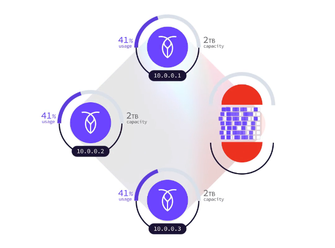
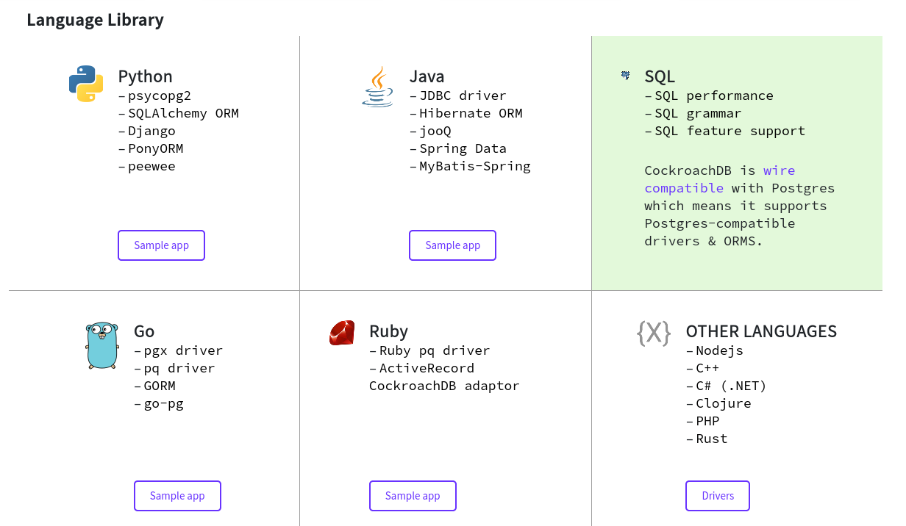

:css: mio.css

.. title:: CockroachDB

----

CockroachDB
============

Pedro Rivera

----

CockroachDB
=============

Base de datos tipo SQL escalable de alta disponibilidad y resilencia

----

Como lo hacen?
===============

- Almacenamiento tipo llave valor almacenados en rangos
- Los rangos contienen solo a una tabla y al llegar a 512MB se dividen
- Los rangos se sincronizan a redundancia 3 por defecto
- Las peticiones a cada rango se gestionan con el modelo de leaseholder
- La sincronizacion de los rangos se hace a cargo de un nodo para cara rango

----

Capas
=======

- API SQL - servicio para externos
- Transaccional - soporte para TX atomicas
- Distribucion - abstraccion del rango
- Replicacion - sincroniza rangos
- Almacenamiento - operaciones I/O en discos

----

Envoltorios para lenguajes
===========================

El api SQL se basa en postgresql

----

Montando un cluster con docker
===============================

Crear una red

.. code:: bash

    docker network create -d bridge roachnet

----

iniciar el cluster
--------------------

Nodo inicial que expone al servicio por el puerto 2657 y 8080

.. code:: bash

    docker run -d \
    --name=roach1 \
    --hostname=roach1 \
    --net=roachnet \
    -p 26257:26257 -p 8080:8080  \
    -v "${PWD}/cockroach-data/roach1:/cockroach/cockroach-data"  \
    cockroachdb/cockroach:v21.1.2 start \
    --insecure \
    --join=roach1,roach2,roach3

----

subir nodos
-------------

Nodos internos del cluster

.. code:: bash

    docker run -d \
    --name=roach2 \
    --hostname=roach2 \
    --net=roachnet \
    -v "${PWD}/cockroach-data/roach2:/cockroach/cockroach-data" \
    cockroachdb/cockroach:v21.1.2 start \
    --insecure \
    --join=roach1,roach2,roach3

----

iniciar cluster y abrir cliente
--------------------------------

Hacer que el primer nodo establezca la conexion con los demas, y
desde el primer nodo se usa el cliente.

.. code:: bash

    # iniciar cluster
    docker exec -it roach1 ./cockroach init --insecure
    # iniciar cliente
    docker exec -it roach1 ./cockroach sql --insecure

----

Bibliografia
=============

- Montar un cluster local https://www.cockroachlabs.com/docs/v21.1/start-a-local-cluster-in-docker-mac.html
- Curso interactivo cockroachdb https://www.cockroachlabs.com/docs/tutorials/build-a-python-app-with-cockroachdb-interactive
- Como funciona internamente: https://www.cockroachlabs.com/docs/stable/architecture/overview.html

----

Gracias